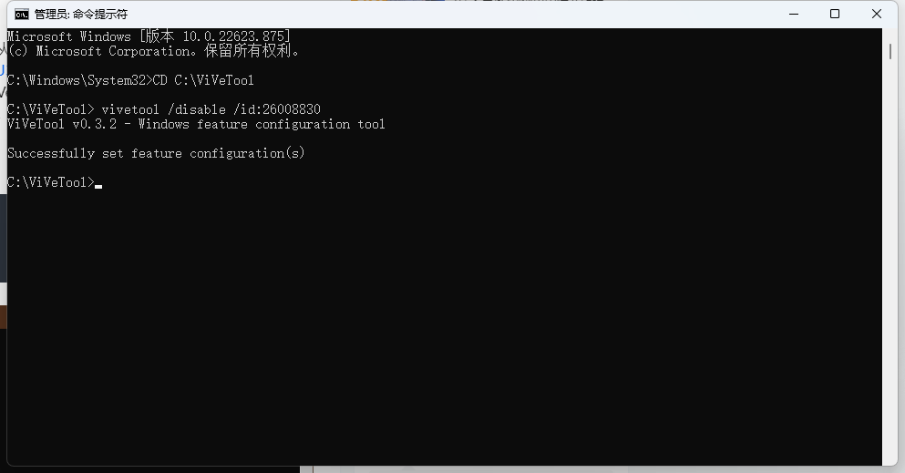

#### 十月份win11系统更新之后，出现了任务栏的 QQ 跟 微信 来信息之后，鼠标浮上去不显示信息预览的问题，很影响使用体验，遂解决该问题并分享。

---

* 1. 在Github 仓库，下载最新的 ViVeTool v0.3.2版本的zip压缩文件 <u>[点击下载](https://github.com/thebookisclosed/ViVe/releases/)</u>


* 2. 解压缩下载下来的zip文件到文件夹，建议去掉文件夹版本号，得到文件夹名为 ViVeTool


* 3. 将该文件夹复制到C盘根目录


* 4. 管理员运行CMD命令窗口，输入下面两行命令：

* 5. 重启电脑，问题解决。


``` 
cd C:\ViVeTool 
```

```yaml
vivetool /disable /id:26008830
```




