## 获取APP ID 和 APP Key


LeanCloud官网: [LeanCloud](https://console.leancloud.app)

请先登录或注册 `LeanCloud`, 注册选择国际版



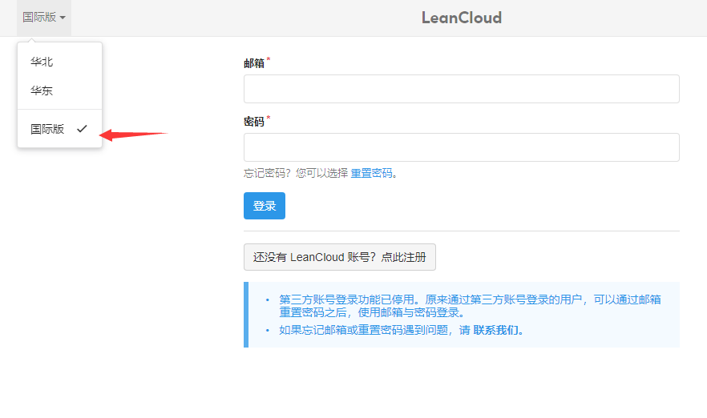



进入控制台，`创建应用`



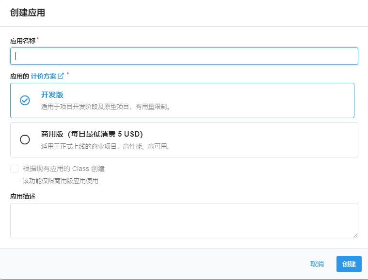



选择`设置`->`应用凭证`，找到AppID 跟 AppKey



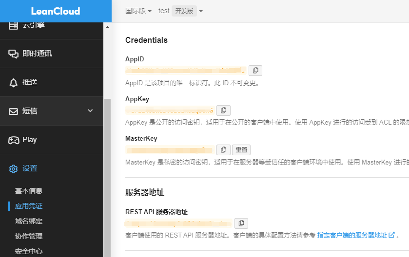



将AppID 跟 AppKey复制到butterfly主题配置文件 `_config.butterfly.yml` 中

找到 `comments` 配置，启用 valine



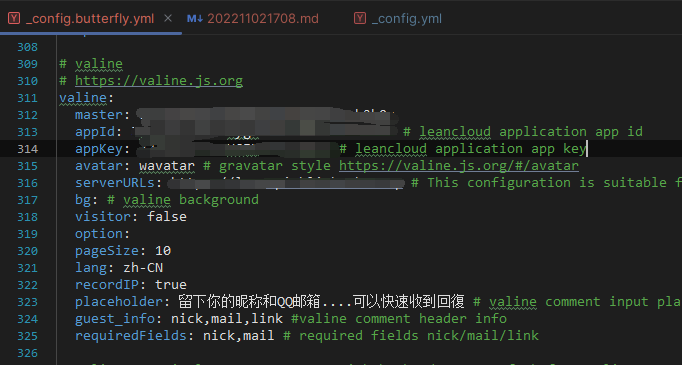
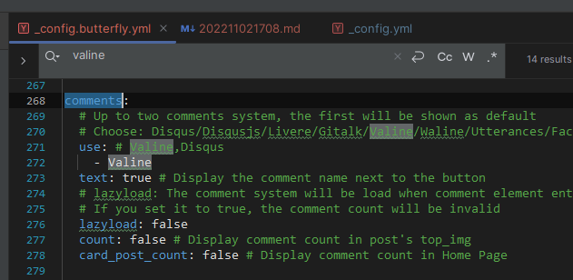


在使用valine作为评论管理开发时发现，默认的leanCloud api接口被墙，所以需要给 leanCloud REST API绑定域名。
域名申请在这边不多说。


## 绑定API访问域名



选择`设置`->`域名绑定`->`API 访问域名`->`绑定新域名`，输入申请的域名,其他默认。点击绑定

绑定成功之后会提示绑定dns，复制推荐DNS配置下面的 `CNAME` 路径，在域名dns控制台加入解析，

等待2-10分钟，刷新页面显示 `已绑定`



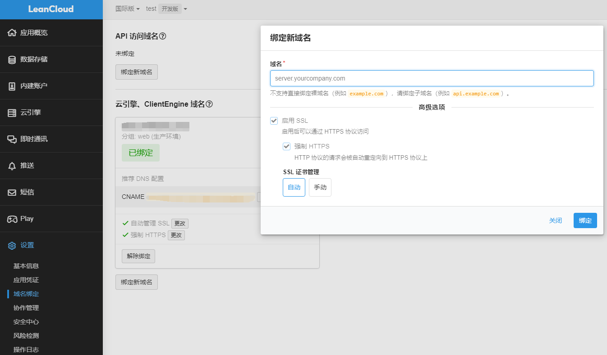
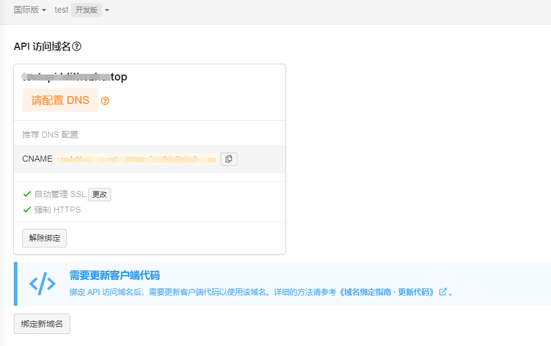
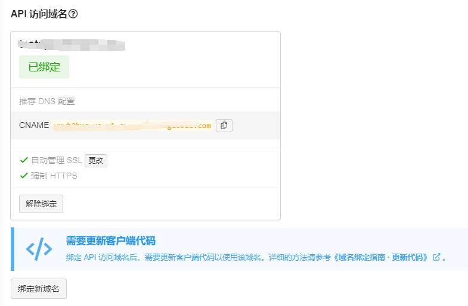



选择`设置`->`应用凭证`->`服务器地址`->`REST API 服务器地址`，到这边可以看到，rest api的地址已经变成你自己的域名
复制api域名，在butterfly主题配置文件 `_config.butterfly.yml` 中，找到`valine`配置，将该域名复制到`serverURLs`



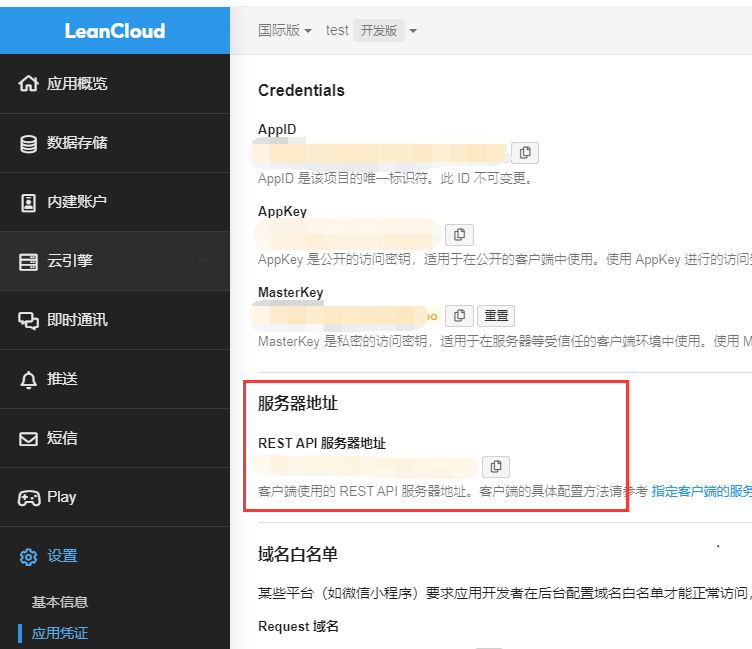
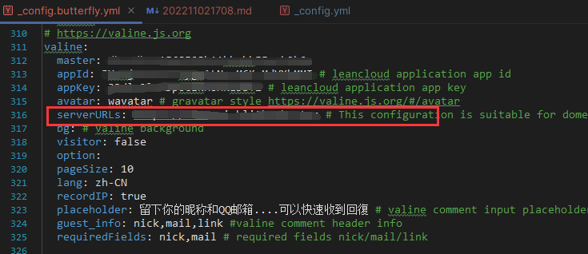



找到`设置`->`安全中心`->`Web 安全域名`， 将博客地址添加到 安全域名下
有多个域名添加多个



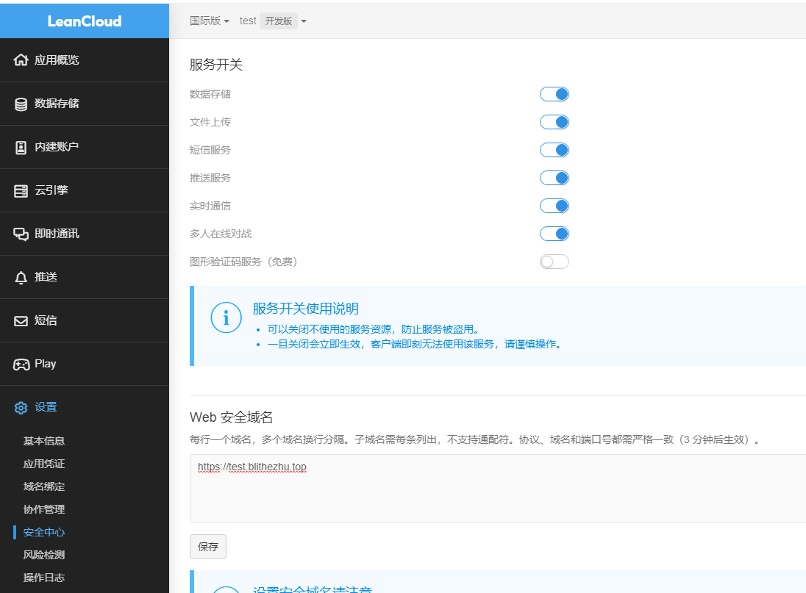


到这边评论系统已经可用，图片评论直接将图片拉到评论框即可
但想着别人评论的时候可以收到通知，于是部署了valine-admin 评论管理系统，并配置了邮件发送
valine-admin 评论管理系统 git仓库地址：https://github.com/DesertsP/Valine-Admin


## 部署Valine-admin评论管理系统系统增加邮件提醒功能

### 绑定后台域名，配置环境变量



找到`云引擎`->`WEB`->`设置` 找到`访问域名`,因为共享域名被墙，所以我选择 `自定义域名`
点击绑定自定义域名，输入申请的子域名点击绑定
复制 `CNAME`，去域名管理平台域名下添加 域名解析
等待2-10分钟，刷新页面，显示绑定成功



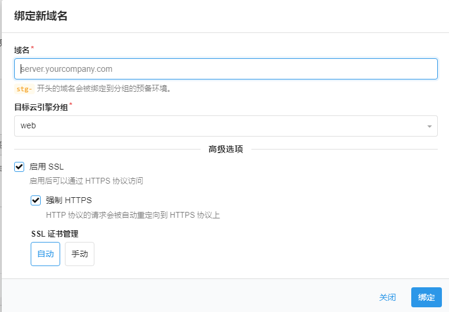
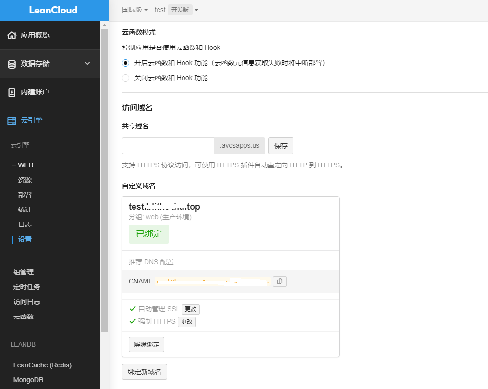



找到`云引擎`->`WEB`->`设置`->`自定义环境变量`,点击 添加新变量
我的变量如下,具体变量名复制往下翻到 `环境变量`



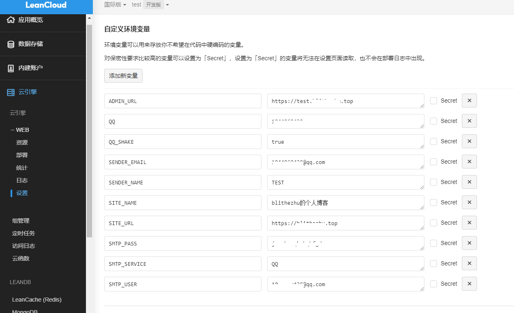



SMTP_PASS，在邮箱账号设置里 开启 IMAP/SMTP服务，会的得到SMTP_PASS值，复制该值到 leanCloud 环境变量 SMTP_PASS 



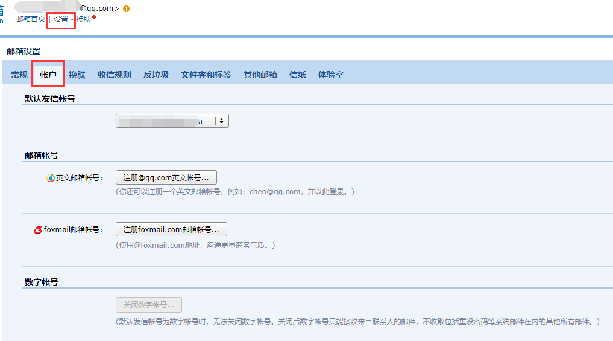
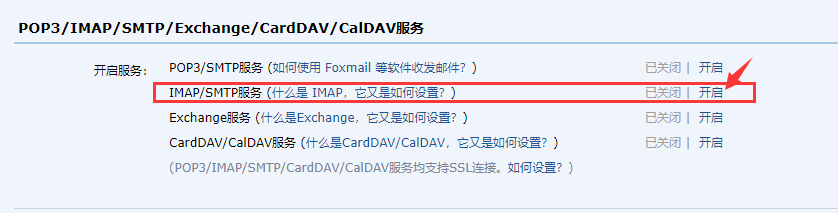

### 环境变量

以下参数需要正确设置。云引擎域名（ADMIN_URL参数）用于评论后台管理

| 变量  | 示例                      | 说明                                                      |
|-----|-------------------------|---------------------------------------------------------|
|SITE_NAME| Deserts                 | [必填]博客名称                                                |
|SITE_URL| https://blogspot.com    | [必填]微博首页地址                                              |
|SMTP_SERVICE| QQ                      | [必填]邮件服务提供商，支持 QQ、163、126、Gmail 以及 更多                   |
|SMTP_USER| xxxxxx@qq.com           | 	[必填]SMTP登录邮箱                                           |
|SMTP_PASS| ccxxxxxxxxch            | [必填]SMTP登录密码（QQ邮箱需要获取独立密码）                              |
|SENDER_NAME| blitheZhu               | [必填]发件人                                                 |
|SENDER_EMAIL| xxxxxx@qq.com           | [必填]发件邮箱                                                |
|ADMIN_URL| https://xxx.leanapp.cn/ | Web主机二级域名（云引擎域名）,上面配置的自定义域名，用于自动唤醒                      |
|BLOGGER_EMAIL| 	xxxxx@gmail.com        | [可选]博主通知收件地址，默认使用SENDER_EMAIL                           |
|AKISMET_KEY| xxxxxxxx                | [可选]Akismet Key 用于垃圾评论检测，设为MANUAL_REVIEW开启人工审核，留空不使用反垃圾 |

### 云引擎部署



找到 `云引擎`->`WEB`->`部署`，点击`部署项目`，选择`Git`部署，输入valine-admin  git地址：
https://github.com/DesertsP/Valine-Admin.git
选择`手动部署`,选择`生产环境`，点击`部署`，部署完成。


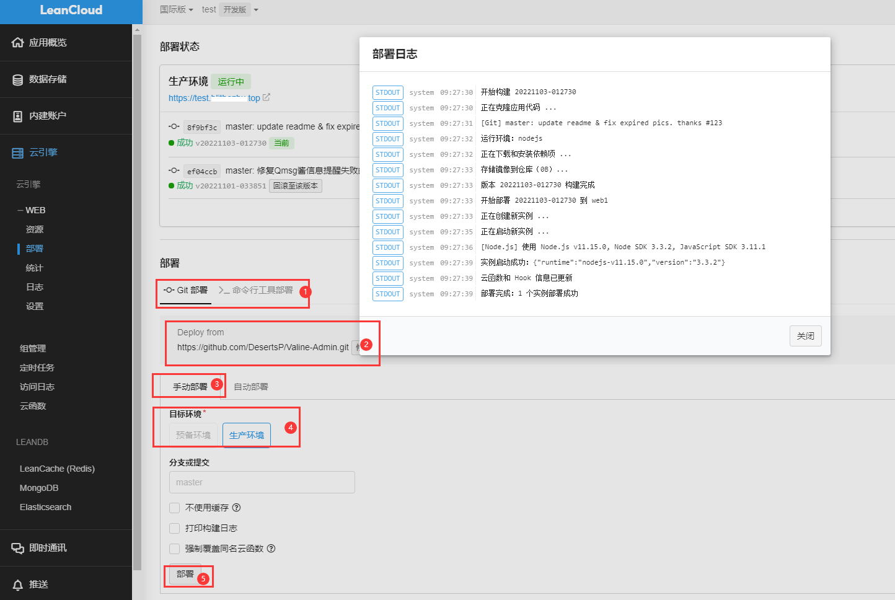



浏览器输入，你配置的后台访问域名，进入管理页面
首先需要设置管理员信息。访问管理员注册页面https://云引擎域名/sign-up,
登录上去即可查看管理评论



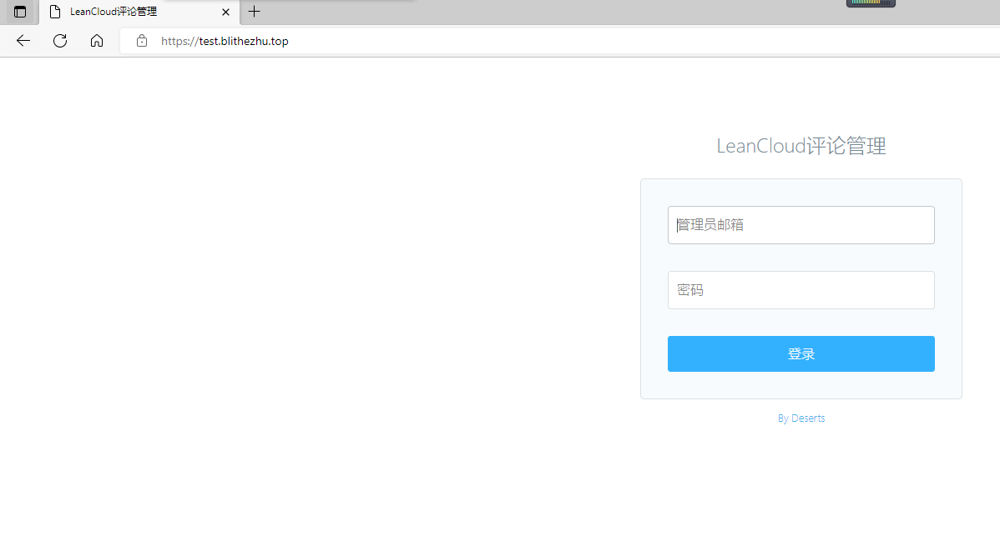
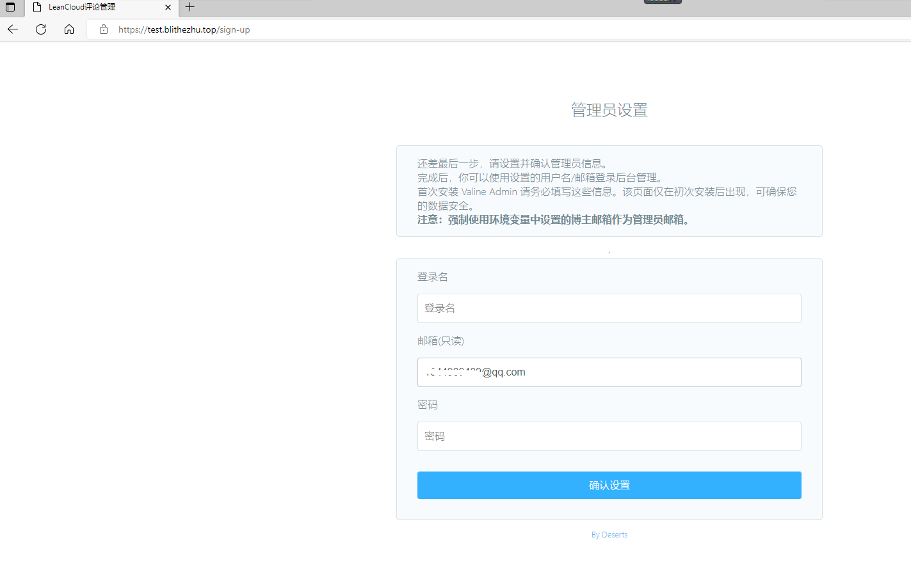
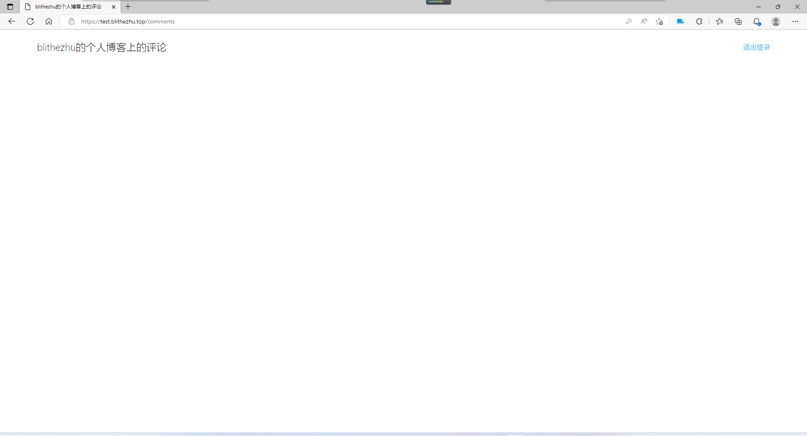



去博客评论下测试，管理平台正常，邮件发送正常


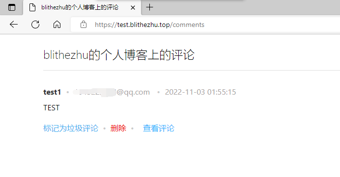
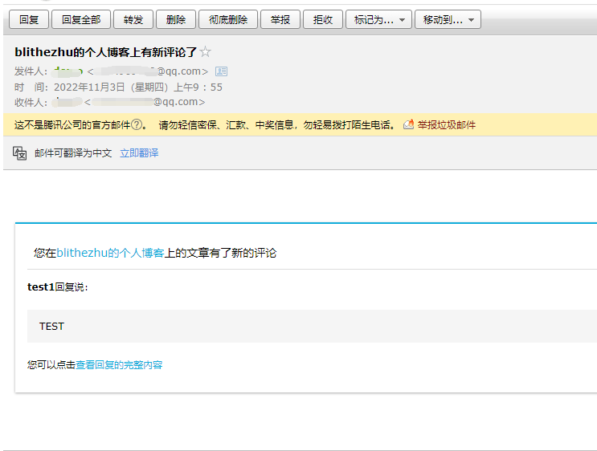


最后设置云引擎定时任务，防止云引擎休眠
找到`云引擎`->`定时任务`->`创建定时任务`
选择`self-wake`云函数，Cron表达式为0 */30 0-16 * * ?，表示每天早0点到晚16点每隔30分钟访问云引擎。

选择`resend-mails`云函数，Cron表达式为0 0 0 * * ?，表示每天0点检查过去24小时内漏发的通知邮件并补发。
打完收工。



注意，我这边没有做`邮件消息模板`的配置，如需配置，请去valine-admin官方文档下查看相应配置
valine-admin Git仓库地址：https://github.com/DesertsP/Valine-Admin

