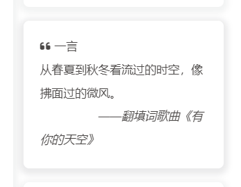

## 配置card_hitokoto配置文件

找到主题config文件`_config.butterfly.yml`,在侧边栏设置中添加 `card_hitokoto: enable: true`
```yaml
aside:
  enable: true
  hide: false
  button: true
  mobile: true # display on mobile
  position: right # left or right
  display:
    archive: false
    tag: true
    category: true
  card_author:
    enable: true
    description:
    button:
      enable: true
      icon: fab fa-github
      text: Follow Me
      link: https://github.com/BlitheZhu
  card_announcement:
    enable: true
    content: 1111111
  card_recent_post:
    enable: true
    limit: 5 # if set 0 will show all
    sort: date # date or updated
    sort_order: # Don't modify the setting unless you know how it works
  card_categories:
    enable: true
    limit: 8 # if set 0 will show all
    expand: none # none/true/false
    sort_order: # Don't modify the setting unless you know how it works
  card_tags:
    enable: true
    limit: 40 # if set 0 will show all
    color: false
    sort_order: # Don't modify the setting unless you know how it works
  card_archives:
    enable: true
    type: monthly # yearly or monthly
    format: MMMM YYYY # eg: YYYY年MM月
    order: -1 # Sort of order. 1, asc for ascending; -1, desc for descending
    limit: 8 # if set 0 will show all
    sort_order: # Don't modify the setting unless you know how it works
  card_webinfo:
    enable: true
    post_count: true
    last_push_date: true
    sort_order: # Don't modify the setting unless you know how it works
  card_hitokoto: # 侧边栏一言
    enable: true
```

## 配置侧边栏代码
在themes/Butterfly/layout/includes/widget/index.pug末尾添加代码：
```
!=partial('includes/widget/card_hitokoto', {}, {cache: true})
```

## 新增card_hitokoto.pug文件

在themes/Butterfly/layout/includes/widget/下 创建`card_hitokoto.pug` 文件，文件内容：
```
.card-widget.card-hitokoto
  .card-content
    .item-headline
      i.fas.fa-quote-left
      span= _p('一言')
      #hitokoto :D 获取中...
      i#hitofrom :D 获取中...
      script(src='https://cdn.jsdelivr.net/npm/bluebird@3/js/browser/bluebird.min.js')
      script(src='https://cdn.jsdelivr.net/npm/whatwg-fetch@2.0.3/fetch.min.js')
      script.
        fetch('https://v1.hitokoto.cn')
          .then(function (res){
          return res.json();
        })
        .then(function (data) {
          var hitokoto = document.getElementById('hitokoto');
          hitokoto.innerText = data.hitokoto;
          var hitofrom = document.getElementById('hitofrom');
          hitofrom.innerText = "　　　　　——" + data.from + '';
        })
        .catch(function (err) {
          console.error(err);
        })
 
```


    搞定收工



